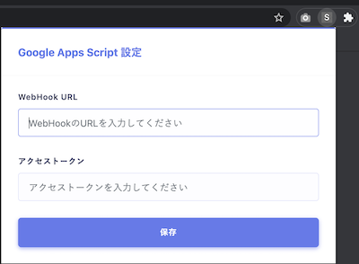

# Stinrg Selection To Google Translation On Chrome Extension

## Can 🤗


### Details 🎉

```
IF Selection.String == Japanese:
    to English

IF Selection.String == English:
    to Japanese
```

**Supported**

- Preview Window Delete by Button!
- Drag & Drop Window

### How to Action this Extension

- Hold down the Alt key and finish selecting sentences

## About 💁‍♂️

### "Chrome_Extension" Directory

That is **Google Chrome Extension**!

### "Google_Apps_Script" Directory

That is **Google Apps Script**!

## Please 🙇‍♂️

Insert **Web Hook URL** and **OAuth Token** for Google Apps Script.



### How to Get OAuth Token 🤔

Run **get_oauth_token()** Function.

## Entry 🥳

- [Qiita](https://qiita.com/huuya/items/1d23e77c91506b8c3462)

## Used By 🙋‍♂️

- [Imgbot](https://github.com/marketplace/imgbot)
    - [Example Pull Request](https://github.com/huuyafwww/Stinrg-Selection-To-Google-Translation-On-Chrome-Extension/pull/1)

Thank you.
