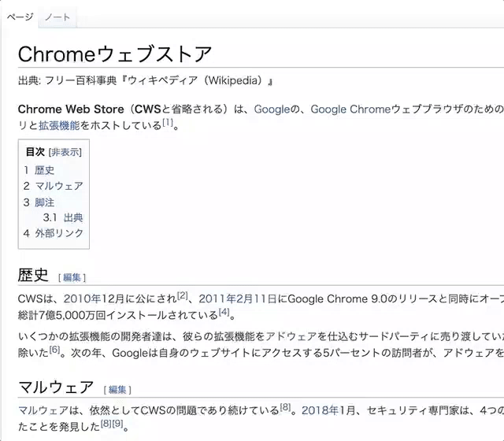

# Stinrg Selection To Google Translation On Chrome Extension

## Can 🤗



### Details 🎉

```
IF Selection.String == Japanese:
    to English

IF Selection.String == English:
    to Japanese
```

## About 💁‍♂️

### "Chrome_Extension" Directory

That is **Google Chrome Extension**!

### "Google_Apps_Script" Directory

That is **Google Apps Script**!

## Please 🙇‍♂️

Edit ```./Chrome_Extension/background/script.js```.

### Line 2

That is **Endpoint** for Google Apps Script!

### Line 3

That is **OAuth Token** for Google Apps Script!

### How to Get OAuth Token 🤔

Run **get_oauth_token()** Function.